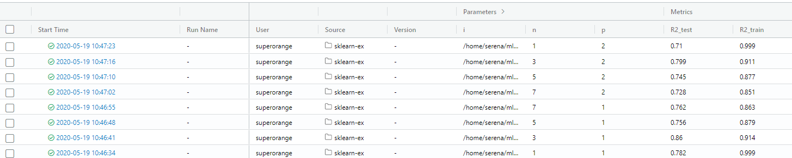
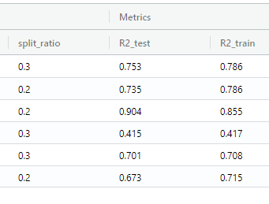
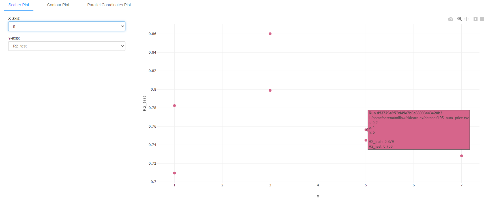

# mlflow

## Setting
### MLproject
```
python <script to run>
```

* Ex: KNN
```
python train_KNN.py
```


## Dataset
### regression
* 195_auto_price.tsv
* 210_cloud.csv
* babies.csv

### classification
* car.csv
* titanic.csv
* wdbc.csv


## Run

* KNN 
```
mlflow run sklearn-ex -P i=/home/serena/mlflow/sklearn-ex/dataset/babies_noNA.csv -P t=bwt -P s=0.2 -P p=1 -P n=1 --experiment-name sklearn-KNN
```

* prameters:
>--p </br>
>--n


## Results comparison
* dashboard


* accuracy comparison


* chart

